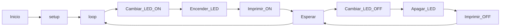
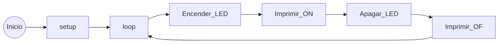

# Práctica 1

## 1. Explicación codigo:

     #include <Arduino.h>
     #define LED_BUILTIN 23
     #define DELAY 50

     void setup() {
     Serial.begin(115200);
     pinMode(LED_BUILTIN, OUTPUT);
     }

    void loop() {
    digitalWrite(LED_BUILTIN, HIGH);
    Serial.println("ON");
    delay(500);
    digitalWrite(LED_BUILTIN, LOW);
    Serial.println("OFF");
    delay(500);
    }

La instrucción "#define LED_BUILTIN 23" define el pin en el que se va a conectar el led, este led es controlado por el codigo.

En la función **setup()**, se inciacliza la configuración y la comunicación serial.

En la función **loop()**, se crea un bucle en el que el led va a encenderse y apagarse en intervalos de 500 milisegundos y va a mostrar un el mensaje "on" si está encendido y el "off" si está apagado.

## 2. Quitando el delay y el serial

### Sin delay:
Quitando el delay podemos observar que el LED cambia de estado rápidamente, con con un intervalo de tiempo que es el que corresponde con las instrucciones que se llevan a cabo en el apartado loop(). El microcontrolador puede ejecutar tareas en paralelo, como otras partes del código, mientras el LED está parpadeando, ya que no estará bloqueado con un tiempo de espera.

### Sin serial ni sin delay:
Quitando el serial junto el delay hace que el LED cambie de estado tan rápido que no se pueda percibir visualmente ya que no hay ningún retraso en las instrucciones. Al eliminar la funcón serial hace que no se envien datos por el puerto serial, lo que puede ser útil para em monitoreo del programa. Como el microcontrolador ejectuta las instrucciones loop() lo más rápido posible supone un mayor consumo de energía.

## 3.Diagrama de flujos:

### Con delay:

En este diagrama de flujos se puede observar todas las acciones que lleva a cabo el codigo, primero se incializa con el setup y luego entra en el loop y entra en el bucle de encender e imprimir es y una vez terminado hay un tiempo de **espera** y vuelve al bucle.

### Sin delay:

En este diagrama de flujos se puede observar todas las acciones que lleva a cabo el codigo, primero se incializa con el setup y luego entra en el loop y entra en el bucle de encender e imprimir, sin **ningún tiempo de espera** adicional.

## 4. Diagrama de tiempos

